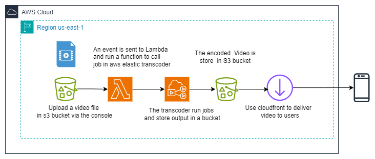

#Project : Stream dynamic content by using Amazon CloudFront
##Overview
In this project, I have use Amazon Elastic Transcoder to convert the video into multiple bit rates that can be streamed to a variety of devices. I have use Amazon S3 to store the source video and transcoded media files. I have use Amazon CloudFront to deliver the media files to the end user.  Amazon Elastic Transcoder Was triggered by Aws lambda function when a new video was uploaded to the S3 bucket.
##Architecture

##Steps
- Step 1: Create an Amazon S3 bucket
- Step 2: Create lambda function,  configure Iam role to access S3 bucket and Elastic Transcoder , configure trigger to S3 bucket .
- Step 3: Create Elastic Transcoder pipeline and configure output bucket and job
- Step 4: Create CloudFront distribution
- Step 5: Upload video to S3 bucket

##AWS Services Used
- Amazon S3
- Amazon Elastic Transcoder
- Amazon CloudFront
- AWS Lambda

##Author
- [Julien AWON'GA](https://www.linkedin.com/in/julienawonga/)
